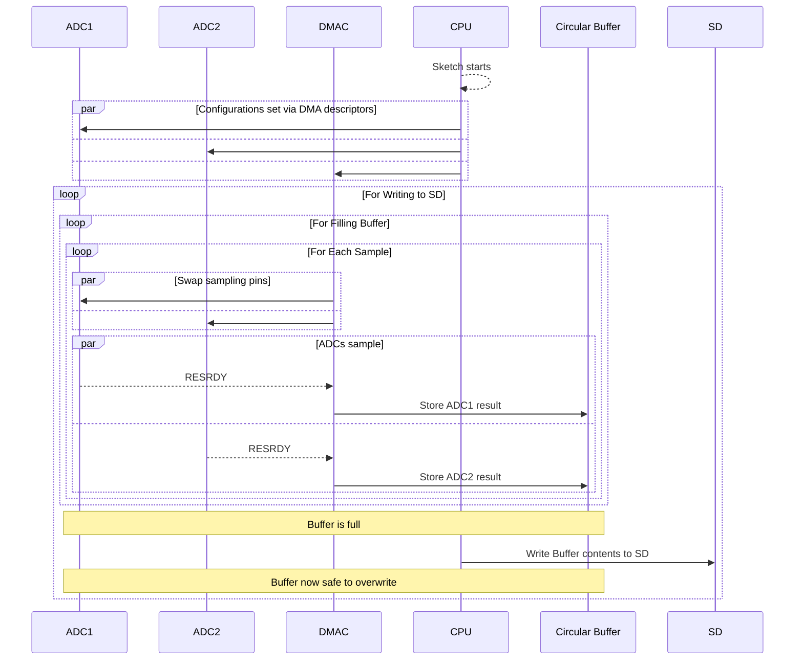

Welcome to the IRIS Notes! This site was made in Obsidian using the [Quartz static-site generator](https://quartz.jzhao.xyz/), hosted on [GitHub](https://github.com/IRIS-Digital-Dosimeter/IRIS-Obsidian-Vault), and deployed using [GitHub Pages](https://github.com/IRIS-Digital-Dosimeter/IRIS-Digital-Dosimeter.github.io). Many of the pages here heavily paraphrase or quote the [SAMD51 Datasheet](https://ww1.microchip.com/downloads/aemDocuments/documents/MCU32/ProductDocuments/DataSheets/SAM-D5x-E5x-Family-Data-Sheet-DS60001507.pdf).

The purpose of this website is to hopefully demystify the software side of IRIS and presenting a more digestible version of the SAMD51 datasheet. As of the creation of this website, we've started migrating to the **Adafruit Feather M4 Express**, so most of the specifics will be tailored to the SAMD51/M4 board. 

In the sidebar, you will find all currently available notes. 
- The *Code Analysis* folder contains notes on code lifted from external sources to help build intuition. 
- The *Quick Starts* folder contains guides on installing and using our software packages.

# Our Approach
## The Problem
The problem we're solving can be boiled down to orchestrating the following:
1. Gather voltage readings from *4 input pins* via the ADCs.
2. Gather accurate timestamps for each ADC sample
3. Store these readings in a comprehensible order/format on an SD card.
4. Collect the data at a frequency *over 1kHz* without dropping any samples.

## The Breakdown
This is essentially a variation of the [Producer-Consumer Problem](https://en.wikipedia.org/wiki/Producer%E2%80%93consumer_problem). Obviously, there are things we must work around first due to hardware constraints:

3. Since the M0/M4 has a single core, reading from the ADC and writing to SD *cannot be done concurrently* by the CPU.
4. Since we have more input pins than ADCs, the readings will be *staggered*, causing long gaps between a pin's readings.
	- If using the ADC's averaging modes, these gaps will be even longer. Since the M4 has 2 ADCs, this problem is easier to handle, but requires more configuration.
5. Since SD cards write in 512 byte chunks and writes have noticeable latency, we must buffer the incoming data for efficiency's sake (N\*512 bytes).
6. Since the CPU's write to SD takes some time, then we must make sure the buffered data has more seconds-of-data than the time it takes to write the buffer to SD. 
	- i.e. If SD write time  is `t_SD` and buffered data holds `t_b` seconds worth of data, then `t_b > t_SD` must be true in order to avoid data loss.

Based on the above, the workflow should look something like this:

- **CPU**
	- Writes instructions and configurations to the DMAC
	- Writes the sample buffers to SD card when triggered
- **DMAC**
	- Flags/Triggers the CPU to begin writes when buffer is ready
	- Writes instructions and configurations to ADC via sequencing
- **ADC**
	- Flags DMAC once a result is ready
- **Buffer**
	- Holds ADC results in multiples of 512 bytes
- **Pins**
	- 4 input pins for the ADC (configurable in `config.h`)
## M0 Approach
The original approach for collecting IRIS data used an [M0 Adalogger](https://www.adafruit.com/product/2796). It comes with a built in SD shield and the ability to use a small LiPo battery for independent operation. The main flaw with this board was the lack of support for **DMA Sequencing**, which enables automatic changes to ADC inputs, essentially automating the required pin-switching functionality with zero delay.

Another flaw lay in the fact that the M0 only has 1 ADC, and the staggered readings between the 4 input pins introduced large gaps for each pin between SD writes. This means there are less datapoints between SD writes for each pin.

## M4 Approach

In order to allow concurrent data collection and SD writing, we use the M4's [[DMA controller]] to address the 2 onboard [[ADC|ADCs]]. The DMAC is configured to collect samples from the ADCs into a buffer. Once the buffer is filled, the CPU begins the process of writing the buffer's contents into the SD card. The DMAC continuously starts new conversions on the ADCs, eliminating previous data loss.
### Buffers

Each ADC will get its own result buffer. Each half of a buffer will take turns being written to. This means that any one time, one half will be *volatile*, being operated on by the DMAC, while the other half will be ready for operations, like writing to SD.

There is also a single, larger buffer which acts as a staging ground for interleaving the 2 ADC result buffers and including timestamps. This process occurs directly before the write to SD.
### ADCs

The current plan is for each ADC to be given 2 pins each to alternate between. This lessens the gaps between each pin's samples. Using *[[ADC#DMA Sequencing]]*, each ADC will be controlled via their own sequencing descriptor which will be responsible for updating the ADC's next input. These descriptors will constantly point back to themselves, allowing us to repeat the input switching endlessly. We refer to these descriptors as *input descriptors.*

Each ADC will also get two descriptors to handle collecting the ready conversions from the result registers (four total output descriptors). The first descriptor is responsible for entering results into the first half of the respective buffer, while the second descriptor is responsible for entering results into the second half of the respective buffer. These descriptors are referred to as *output descriptors*.
### SD

Physically, the SD card is mounted on a [Adafruit Adalogger Featherwing](https://www.adafruit.com/product/2922) which sits directly atop the [[M4 Board]]. The M4 uses SPI to communicate with the SD card, and uses pin `10` as the chip-select. This featherwing also gives us access to a high precision RTC module, though it currently sits unused.

In software, we use the [Adafruit fork of the SdFat library](https://github.com/dzalf/SdFat---Adafruit-Fork), which gives much better control and latency compared to the default Arduino SD library. We currently preallocate several megabytes of data per file, and commit to disk frequently to minimize data-loss from sudden power loss.
### Timestamps

Current timestamps are taken directly *after* a results buffer is filled. This means that individual timestamps must be interpolated in post-processing. This is currently done using `numpy.linspace()`, creating evenly timed timestamps based on the current and previous timestamps, and knowing `NUM_RESULTS` in advance.

This is done for 3 main reasons:
- ADC sample collection happens independently of CPU operation
- `micros()` calls are non-trivial and require calculation (thus more time)
	- problematic for high-speed software variants
- Timestamps can't be taken at the same time as SD writes
