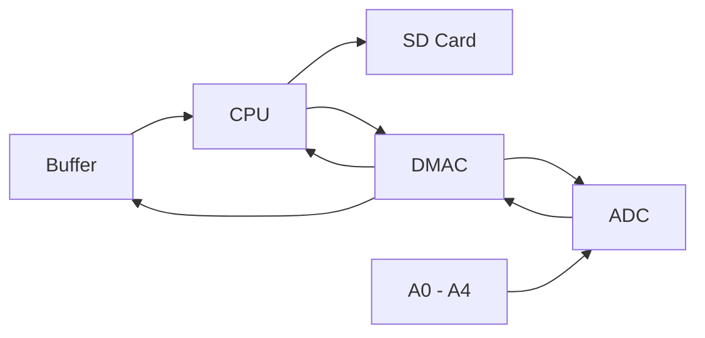

Currently, the IRIS board is transitioning from the [Adafruit M0 Adalogger](https://www.adafruit.com/product/2796) to the [M4 Express](https://www.adafruit.com/product/3857) and [Datalogging FeatherWing](https://www.adafruit.com/product/2922). The transition is being made because the SD write latency with the M0 was simply too high. Hopefully, the M4's SAMD51 chip will be more than enough for our purposes.

As described in the [[20 - Professional/21 - SCIPP/21.01 - IRIS/IRIS/IRIS|IRIS]] notes, the current approach is as follows:

In order to allow concurrent data collection and SD writing, we use the M4's SAMD51's [[DMA controller]] to control the 2 onboard [[ADC|ADCs]]. The DMAC is configured to collect samples from the ADCs into a buffer. Once the buffer is filled, the CPU begins the process of writing the buffer's contents into the SD card. The DMAC then starts new conversions on the ADCs.

The 2 ADCs each alternate between 2 pins, interleaving the results into the buffer (A0, A1, A2, A3, A1, A2, etc).

> [!warning]
> Looks like Adafruit's SPI library overwrites register level DMAC programming according to [[Resources#^99fd12|MartinL]], which may be causing the issues that came up with using the M0's SD card with DMA. 