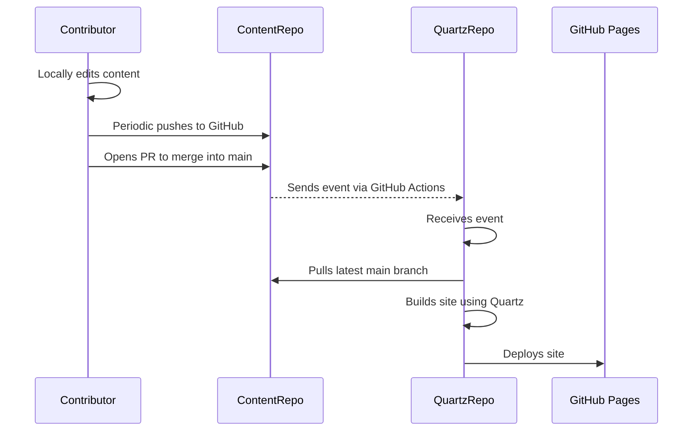

## What is it built on?
This site is built on [Quartz](https://quartz.jzhao.xyz/), a very cool static-site generator that converts Markdown files into webpages (like this one).

### The Pieces
This website has two GitHub repositories behind the scenes - one for content, and one for Quartz itself. These repositories work together via GitHub actions to convert the Markdown notes into static pages, which are then hosted by GitHub.

## How do you add to it?
Check out [[Contributing|the Contributor's guide]] which describes exactly how to add or edit notes to the website.